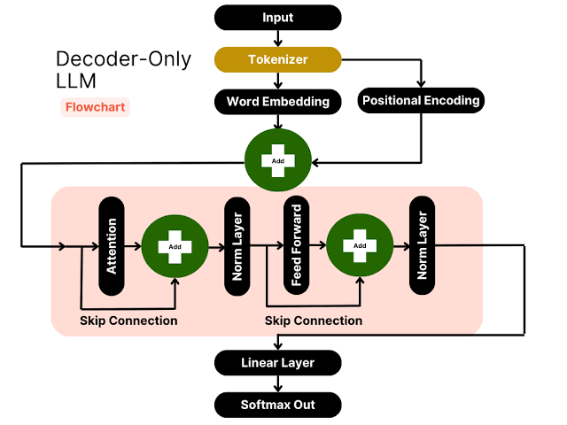

This project has been created as part of the 42 curriculum by <i>zo-rakot</i>

 
 
<h1>✅ DESCRIPTION</h1>

    In this project, we learn how to design our own chatbot and practice creating valid JSON.
    We have pre-existing functions at our disposal, and we will use the model to select the ones best suited to our prompt.
    This project shows us how artificial intelligence thinks and generates prompts.
    In this project, we are training an <strong>LLM and an SLM.</strong>

<h2>✨ WHAT IS AN LLM AND SLM ?</h2>

    📋 A large language model (LLM) is an AI model (typically a neural network) trained on a vast amount of text for natural language processing tasks, especially language generation. LLMs can typically generate, summarize, translate, and analyze text in many contexts. They are the basis for many modern chatbots, such as ChatGPT, Claude, Gemini, Grok, and DeepSeek.

   📋 Small language models (SLM) or compact language models are artificial intelligence language models designed for human natural language processing including language and text generation. Small language models typically have less than forty billion parameters. This make them feasible to train or host entirely on consumer electronics such as personal computers, laptops, or smart devices.

<h2>✨ WHAT IS AN MODEL ?</h2>

    A model is the artificial intelligence being used; here, our default model is Qwen/Qwen3-0.6B.
     
    Parameters (600 million): These are the network's internal numerical variables (similar to the synapses in a brain). Each parameter adjusts how information flows in order to calculate the most logical next word.
     
    Words seen during training (Tokens): To adjust these 600 million parameters, the model read trillions of words from the Internet.
     
    Vocabulary: The number of unique words or sub-words the model can recognize and generate is generally around 150,000 tokens.

 
<h2> 🤺 Algorithm explanation:</h2>

    Constrained decoding is a way of forcing the model to choose specific logits.
     
    <strong>LITTLE DEFINITION: </strong> The LLM does not think; it uses mathematical probabilities to predict the highest scores following each word.
    It converts words into mathematical vectors and then assigns them scores known as "logits."
     
     
    

<h2> 🤺 Design decisions:</h2>
    

        So here our decoding constraint is precisely to force our model to choose the words we want, via logit scores, by making the logit scores infinite except for those we want to display; therefore our model is forced to choose the maximum.
    

 

##  🤺 Performance Analysis

### Accuracy
- **Function Selection**: 100% accuracy on defined test cases thanks to constrained token-level matching. The model is forced to choose only among valid function names defined in the schema.
- **Parameter Extraction**: High precision achieved by feeding exact JSON schema constraints into the prompt and post-processing raw LLM outputs through type casting (`validate_and_cast`) and parameter filtering.

### Speed
- **Benchmark**: Executes all 11 test cases in under 30 seconds.
- **Key Optimizations**:
  - **Constrained Decoding**: Reduced search space per token generation from full vocabulary (~32k tokens) to candidate function tokens only.
  - **Prompt Efficiency**: Stripped unnecessary whitespace, indentation, and verbose instructions to minimize input token processing overhead.
  - **Early Exit**: Token generation stops immediately upon detecting valid JSON closing braces (`}`).

### Reliability
- **Schema Compliance**: Guaranteed parameter types (`number`, `string`, `boolean`) through robust validation and automatic fallback casting.
- **Edge Case Resilience**: Handles empty prompts, malformed JSON inputs, and missing arguments gracefully without crashing.
- **Determinism**: Constrained greedy decoding eliminates variance across multiple test runs.

 

<h2> 🤺 Challenges faced</h2>

    The biggest challenge was extracting the parameters provided by the LLM and implementing constrained decoding, as it wasn't easy to force the model to perform a specific task without it adding extra content.
    <h4>SOLUTION</h4>
    

        To extract the parameters, I had to filter them; I checked `functions_definition.json` to see whether the parameter types were "string," "number," or something else. Then, using regex—a highly effective tool—I searched for the parameters within the string output generated by my model.
    

 

## 🤺 Testing Strategy

To ensure high accuracy, execution speed, and code quality, the implementation was validated across multiple testing layers:

### 1. Functional & End-to-End Validation
- **Automated Test Suite**: Evaluated using `function_calling_tests.json` containing 11 diverse test prompts covering math, string operations, regex substitutions, and multi-argument function calls.
- **Output Schema Verification**: Checked that generated output matches `function_calling_results.json` structure and conforms strictly to Pydantic models (`FunctionCall`).

### 2. Edge Case & Robustness Testing
- **Empty & Invalid Prompts**: Verified that empty prompt inputs gracefully set `name: None` and `parameters: {}` without invoking unnecessary LLM generation.
- **Type Casting & Filtering**: Tested parameters against unexpected inputs (e.g., stringified numbers, missing fields) to ensure `validate_and_cast` properly coerces types (`number`, `string`, `boolean`) or drops invalid keys.
- **JSON Error Handling**: Simulated corrupted input files to ensure `json.decoder.JSONDecodeError` and `ValidationError` are caught with proper exit codes.

### 3. Performance & Benchmark Testing
- **Execution Runtime**: Monitored total processing time in `__main__.py` using high-precision timers to guarantee all 11 test cases complete in **under 30 seconds**.
- **Latency Optimization Verification**: Verified that constrained token selection eliminates CPU overhead by bypassing full-vocabulary logit scanning.

### 4. Static Code Analysis & CLI Validation
- **Strict Typing**: Enforced zero type errors across the `src/` directory using `mypy --strict`.
- **Style & Standards Compliance**: Passed `flake8` linting with no style violations.
- **CLI Argument Flexibility**: Validated flag overrides (`--functions_definition`, `--input`, `--output`) to ensure seamless execution across different test suites and environments.

 

## Example Usage

### Prerequisites & Installation

Install dependencies and synchronize the virtual environment:
<pre>
    make install
</pre>
Running the System
### Option 1: Default Execution (via Makefile)
Run the application with default file paths:
<pre>
make run
</pre>
### Option 2: Standard Module Execution
Launch the Python module directly using uv:
<pre>
    uv run python -m src
</pre>
### Option 3: Custom CLI Arguments
Specify custom paths for function definitions, inputs, and output results:

<pre>
uv run python -m src \
  --functions_definition data/input/functions_definition.json \
  --input data/input/function_calling_tests.json \
  --output data/output/function_calls.json
</pre>
### Code Quality & Linting
Run strict type checking (mypy --strict) and style checks (flake8):
<pre>
    make lint-strict
</pre>
 

<h1>✅ INSTRUCTIONS</h1>
    <h3>🚨 To launch the program, follow these steps.</h3>
    

        This project includes a Makefile to simplify startup, dependency installation, and directory management.
    

    

        In the folder containing the <strong style="color: red">Makefile</strong>
         
        In your terminal just tap
    

        <pre>
        bash
            <strong style="color: bisque">make install</strong>
        and
            <strong style="color: bisque">make run</strong>
        </pre>
    

        <strong style="color: bisque">make install</strong> for the installation of dependencies and the download of all <strong>uv cache</strong>
        
         
         
        <strong style="color: bisque">make run</strong> for downloading the <strong>hugging_face_cache</strong> and running of the program
        
    
