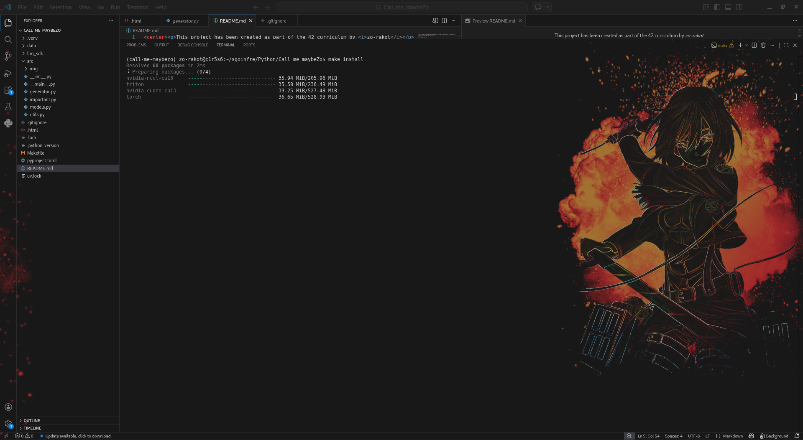
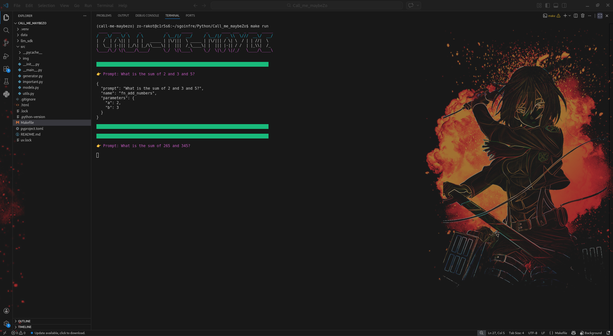

This project has been created as part of the 42 curriculum by <i>zo-rakot</i>

 
<h1>✅ DESCRIPTION</h1>

    In this project, we learn how to design our own chatbot and practice creating valid JSON.
    We have pre-existing functions at our disposal, and we will use the model to select the ones best suited to our prompt.
    This project shows us how artificial intelligence thinks and generates prompts.
    In this project, we are training an <strong>LLM and an SLM.</strong>

<h2>✨ WHAT IS AN LLM AND SLM ?</h2>

    📋 A large language model (LLM) is an AI model (typically a neural network) trained on a vast amount of text for natural language processing tasks, especially language generation. LLMs can typically generate, summarize, translate, and analyze text in many contexts. They are the basis for many modern chatbots, such as ChatGPT, Claude, Gemini, Grok, and DeepSeek.

   📋 Small language models (SLM) or compact language models are artificial intelligence language models designed for human natural language processing including language and text generation. Small language models typically have less than forty billion parameters. This make them feasible to train or host entirely on consumer electronics such as personal computers, laptops, or smart devices.

<h1>✅ INSTRUCTIONS</h1>
    <h3>🚨 To launch the program, follow these steps.</h3>
    

        This project includes a Makefile to simplify startup, dependency installation, and directory management.
    

    

        In the folder containing the <strong style="color: red">Makefile</strong>
         
        In your terminal just tap
    

        <pre>
        bash
            <strong style="color: bisque">make install</strong>
        and
            <strong style="color: bisque">make run</strong>
        </pre>
    

        <strong style="color: bisque">make install</strong> for the installation of dependencies and the download of all <strong>uv cache</strong>
        
         
        <strong style="color: bisque">make run</strong> for downloading the <strong>hugging_face_cache</strong> and running of the program
        
    
